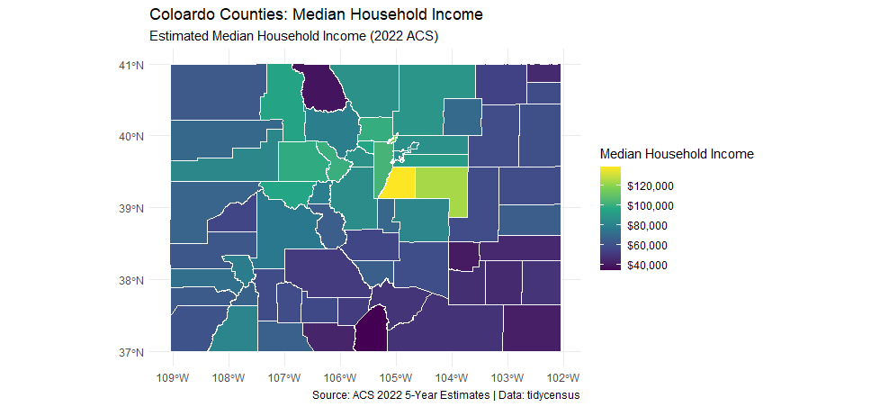

<br>

<center>
**[Denver, CO] | [858-349-4783] | [durkinrm@gmail.com] | [https://www.linkedin.com/in/ryan-durkin-1b93aaa2/] | [https://github.com/Phrease]**
</center>

<br>

### **Summary**

A highly motivated and detail-oriented data analyst with a passion for uncovering insights from data. Proficient in R for data manipulation, statistical analysis, and visualization. Seeking to leverage my analytical skills to solve complex problems and contribute to a data-driven organization.

---

### **Skills**

* **Programming Languages:** R (Advanced), SQL (Advances), Python (Intermediate)
* **R Libraries:** `dplyr`, `ggplot2`, `tidyr`, `readr`, `shiny`, `rmarkdown`, `lubridate`
* **Data Visualization:** ggplot2, Tableau, Power BI
* **Databases:** PostgreSQL, MySQL, SQLite
* **Tools:** RStudio, Git & GitHub, Jupyter Notebooks

---

## **Project Showcase**

---

### **Project 1: Analyzing Colorado Counties via Rent Burden & Median Household Income**

* **Objective:** To analyze historical housing data for Colorado counties to identify trends in pricing, inventory, and sales volume over the last three years.

* **Description:** This project involved sourcing data from the ACS, going back to 2022 (with 5 year estimates), cleaning and wrangling the data using `dplyr`, and performing time-series analysis to identify seasonal patterns and long-term trends. The final output was an R Markdown report with interactive visualizations created using `ggplot2` and `tidycensus`.

* **Key Skills Demonstrated:** Data Cleaning, Data Wrangling, Time-Series Analysis, Data Visualization, R Markdown Reporting.

* **Code:** [Link to GitHub Repository for this Project](https://github.com)
* **Live Report/Dashboard:** [Link to RPubs or Shiny App](https://rpubs.com/)

<br>

```{r denver-housing-plot, echo=FALSE, fig.cap="Coloardo Counties Rent Burden compared to Median Household Income", out.width="100%"}
# Load the following libraries
library(tidycensus)
library(tidyverse)
library(sf)
library(ggplot2)
library(viridis)
library(scales)

# Access the Census Public Dataset for us income analysis
# census_api_key("22aeebd83dd72c7097e468b3963028eab9716cf8", install = TRUE)

# Load variables for the 5-year ACS for the most recent available year (e.g.; 2022)
# The 'cache = TRUE' argument makes the subsequent calls faster
acs_variables = load_variables(year = 2022, dataset = "acs5", cache = TRUE)

# Define the variables
# Define the variables for our analysis using descriptive names that we will use in our dataframe
my_variables <- c(
  median_gross_rent = "B25064_001",
  median_house_income = "B19013_001"
)

# Gross Rent as a Percentage of Household Income (B25070)
rent_burden_variables <- c(
  total_renter_occupied = "B25070_001",
  rent_lt_10_pct = "B25070_002",
  rent_10_14_9_pct = "B25070_003",
  rent_15_19_9_pct = "B25070_004",
  rent_20_24_9_pct = "B25070_005",
  rent_25_29_9_pct = "B25070_006",
  rent_30_34_9_pct = "B25070_007",
  rent_35_39_9_pct = "B25070_008",
  rent_40_49_9_pct = "B25070_009",
  rent_50_plus_pct = "B25070_010",
  # Units for which rent burden could not be computed
  rent_not_computed = "B25070_011"
)

# Combine all variables into a single list for get_acs()
all_my_variables <- c(my_variables, rent_burden_variables)

# Verify variables came through
# print(all_my_variables)

# Get Median Gross Rent and Median Household Income by County for Colorado
# Download data at the county level for Colorado, using the 5-year ACS
colorado_data_raw <- get_acs(
  geography = "county",
  variables = all_my_variables,
  state = "CO",
  year = 2022,
  survey = "acs5",
  geometry = TRUE
)

# Inspect the first few rows and the structure of the downloaded data
print(head(colorado_data_raw))
print(glimpse(colorado_data_raw))

# Pivot data from long to wide format
colorado_data_wide <- colorado_data_raw %>%
  pivot_wider(
    names_from = variable,
    values_from = c(estimate, moe)
  )

# --- CRITICAL FIX: Temporarily remove the problematic 'agr' attribute (REVISED and CORRECTED) ---
# This prevents the 'internal error: can't find `agr` columns' during rename
colorado_data_cleaned <- colorado_data_wide %>%
  # Correct way to remove the 'agr' attribute within a pipe
  # This sets the 'agr' attribute of the sf object to NULL, bypassing the st_set_agr function's strict checks
  { attr(., "agr") <- NULL; . } %>%
  # 2. Rename the columns for clarity (these names correspond to our 'all_my_variables' vector's names)
  # IMPORTANT: The column names from pivot_wider will be "estimate_your_variable_name"
  # and "moe_your_variable_name"
  rename(
    median_gross_rent = estimate_median_gross_rent,
    median_house_income = estimate_median_house_income,
    total_renter_occupied = estimate_total_renter_occupied,
    rent_lt_10_pct = estimate_rent_lt_10_pct,
    rent_10_14_9_pct = estimate_rent_10_14_9_pct, 
    rent_15_19_9_pct = estimate_rent_15_19_9_pct, 
    rent_20_24_9_pct = estimate_rent_20_24_9_pct, 
    rent_25_29_9_pct = estimate_rent_25_29_9_pct, 
    rent_30_34_9_pct = estimate_rent_30_34_9_pct, 
    rent_35_39_9_pct = estimate_rent_35_39_9_pct, 
    rent_40_49_9_pct = estimate_rent_40_49_9_pct, 
    rent_50_plus_pct = estimate_rent_50_plus_pct, 
    rent_not_computed = estimate_rent_not_computed,
    # Also rename the MOE columns
    moe_median_gross_rent = moe_median_gross_rent,
    moe_median_house_income = moe_median_house_income,
    moe_total_renter_occupied = moe_total_renter_occupied,
    moe_rent_lt_10_pct = moe_rent_lt_10_pct, 
    moe_rent_10_14_9_pct = moe_rent_10_14_9_pct, 
    moe_rent_15_19_9_pct = moe_rent_15_19_9_pct, 
    moe_rent_20_24_9_pct = moe_rent_20_24_9_pct, 
    moe_rent_25_29_9_pct = moe_rent_25_29_9_pct, 
    moe_rent_30_34_9_pct = moe_rent_30_34_9_pct, 
    moe_rent_35_39_9_pct = moe_rent_35_39_9_pct, 
    moe_rent_40_49_9_pct = moe_rent_40_49_9_pct, 
    moe_rent_50_plus_pct = moe_rent_50_plus_pct, 
    moe_rent_not_computed = moe_rent_not_computed
  ) %>%
  # Handle any potential NaN/Inf values that can arise from divisions by zero or NA values
  mutate(across(where(is.numeric), ~replace_na(., 0))) # This should now work on the renamed columns

# Calculate key rent burden metrics
colorado_data_final <- colorado_data_cleaned %>%
  mutate(
    computable_renters_total = total_renter_occupied - rent_not_computed,
    pct_rent_50_plus = (rent_50_plus_pct / pmax(1, computable_renters_total)) * 100,
    pct_rent_30_plus = ((rent_30_34_9_pct + rent_35_39_9_pct + rent_40_49_9_pct + rent_50_plus_pct) / pmax(1, computable_renters_total)) * 100,
    pct_rent_35_plus = ((rent_35_39_9_pct + rent_40_49_9_pct + rent_50_plus_pct) / pmax(1, computable_renters_total)) * 100
  ) %>%
  filter(computable_renters_total > 0)

# Inspect the transformed data
print(head(colorado_data_final))
print(glimpse(colorado_data_final))
print(colnames(colorado_data_final))

# Visualizie Rent Burden: Percentage 50% or more on rent
map_rent_50_plus <- ggplot(data = colorado_data_final) +
  geom_sf(aes(fill = pct_rent_50_plus), color = "white", lwd = 0.1) + # Set border color and thickness
  scale_fill_viridis_c(
    option = "magma",
    name = "% Severly Burdened", # Legend title
    labels = scales::label_percent(scale = 1), # Format as percentage
    direction = -1 # Reverse colors if desired (darker for higher values)
  ) +
  labs(
    title = "Colorado Counties: Rent Burden (50%+ of Income)",
    subtitle = "Percentage of Renter-Occupied Households Spending 50% or More on Rent",
    caption = "Sources: ACS 2022 5-Year Estimates | Data: tidycensus"
  ) +
  theme_minimal() + 
  theme(
    plot.title = element_text(hjust = 0.5, face = "bold"),
    plot.subtitle = element_text(hjust = 0.5),
    legend.position = "right"
  )

# Print results
print(map_rent_50_plus)

# --- Visualize Median Household Income ---
map_median_income <- ggplot(data = colorado_data_final) +
  geom_sf(aes(fill = median_house_income), color = "white", lwd = 0.1) +
  scale_fill_viridis_c(
    option = "viridis",
    name = "Median Household Income",
    labels = scales::label_dollar(), # Format as dollar amount
    direction = 1 # Keep default direction
  ) +
  labs(
    title = "Coloardo Counties: Median Household Income",
    subtitle = "Estimated Median Household Income (2022 ACS)",
    caption = "Source: ACS 2022 5-Year Estimates | Data: tidycensus"
  ) +
  theme_minimal()
  theme(
    plot.title = element_text(hjust = 0.5, face = "bold"),
    plot.subtitle = element_text(hjust = 0.5),
    legend.position = "right"
  )

print(map_median_income)

# Calculate the Pearson correlation coefficient
correlation_coefficient <- cor(colorado_data_final$median_house_income,
                               colorado_data_final$pct_rent_50_plus,
                               use = "pairwise.complete.obs")

print(paste("Pearson Correlation Coefficient between Median Income and Percentage 50% Rent Burdened:", round(correlation_coefficient, 3), ". This correlation coefficient tells you that it's not simply 'richer counties have less severe rent burden' or 'poorer counties have more severe rent burden' in a straightforward, linear way. The situation is more nuanced and complex, driven by a blend of income distribution, actual housing costs, and other economic factors specific to each county."))


```
